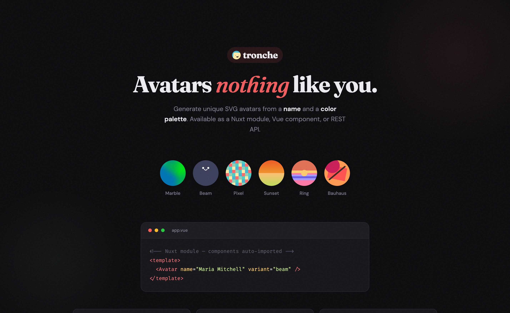

# tronche

Avatars nothing like you.

Tronche generates unique SVG avatars from a name and a color palette. Available as a [vanilla JS package](#vanilla-usage) (no framework), a [Vue component](#vue-usage), a [React component](#react-usage), a [Solid component](#solid-usage), a [Svelte component](#svelte-usage), a [Nuxt module](#nuxt-module), and a [REST API](#rest-api).

## Installation

```sh
npm install tronche
```

### Package structure

```
node_modules/tronche/
├── dist/
│   ├── index.js         # Core library (ESM, framework-agnostic)
│   ├── index.d.ts       # Core TypeScript declarations
│   ├── vue/
│   │   ├── index.js     # Vue components (pre-compiled)
│   │   └── index.d.ts   # Vue component types
│   ├── react/
│   │   ├── index.js     # React components (pre-compiled)
│   │   └── index.d.ts   # React component types
│   ├── solid/
│   │   ├── index.js     # Solid components (pre-compiled)
│   │   └── index.d.ts   # Solid component types
│   ├── svelte/
│   │   ├── index.js     # Svelte components (pre-compiled)
│   │   └── index.d.ts   # Svelte component types
│   ├── module.js        # Nuxt module
│   └── module.d.ts      # Module types
└── package.json
```

### Consumption

| Import path | Environment | Example |
|-------------|-------------|---------|
| `tronche` | Vanilla JS/TS | `import { generateBeamSvg } from 'tronche'` |
| `tronche/vue` | Vue 3 | `import { Avatar } from 'tronche/vue'` |
| `tronche/react` | React 18+ | `import { Avatar } from 'tronche/react'` |
| `tronche/solid` | SolidJS 1.8+ | `import { Avatar } from 'tronche/solid'` |
| `tronche/svelte` | Svelte 5+ | `import { Avatar } from 'tronche/svelte'` |
| `tronche/module` | Nuxt 3+ | `modules: ['tronche/module']` |

## Vanilla Usage

Use the core generators directly in any JavaScript environment — no framework required.

```ts
import { generateBeamSvg } from 'tronche'

const svg = generateBeamSvg('Clara Barton', ['#E07A5F', '#3D405B', '#81B29A', '#F4D06F', '#D8A47F'], {
  size: 120,
  square: false,
})
// svg is a string: '<svg viewBox="0 0 36 36"...'
document.body.innerHTML = svg
```

Each variant exports three functions:

| Function | Returns | Use case |
|----------|---------|----------|
| `generateMarbleData(name, colors)` | Data object | Feed into Vue template or custom renderer |
| `renderMarbleSvg(data, options)` | SVG string | Convert data to SVG with display options |
| `generateMarbleSvg(name, colors, options)` | SVG string | One-shot generation (calls both above) |

Replace `Marble` with `Beam`, `Pixel`, `Sunset`, `Ring`, or `Bauhaus` for other variants.

```ts
import {
  generateMarbleSvg, generateBeamSvg, generatePixelSvg,
  generateSunsetSvg, generateRingSvg, generateBauhausSvg,
} from 'tronche'
```

## Nuxt Module

Add the module to your `nuxt.config.ts` — components are auto-imported.

```ts
export default defineNuxtConfig({
  modules: ['tronche/module'],
})
```

```vue
<template>
  <Avatar name="Maria Mitchell" variant="beam" />
</template>
```

### Module options

```ts
tronche: {
  prefix: 'T',  // components become TAvatar, TAvatarBeam, etc.
}
```

## Vue Usage

```vue
<script setup>
import { Avatar, AvatarMarble, AvatarBeam } from 'tronche/vue'
</script>
<template>
  <Avatar
    name="Grace Hopper"
    :colors="['#fb6900', '#f63700', '#004853']"
    variant="marble"
    :size="120"
    square
  />
</template>
```

### Props

| Prop | Type | Default | Description |
|------|------|---------|-------------|
| `name` | `string` | `Clara Barton` | Seed for deterministic generation |
| `variant` | `string` | `marble` | Avatar style: `marble`, `beam`, `pixel`, `sunset`, `ring`, `bauhaus` |
| `size` | `number` | `80` | Width/height in pixels |
| `square` | `boolean` | `false` | Square crop (otherwise rounded) |
| `colors` | `string[]` | built-in palette | Custom hex colors |
| `title` | `boolean` | `false` | Show title element |

## React Usage

```tsx
import { Avatar, AvatarMarble } from 'tronche/react'

function Profile() {
  return (
    <Avatar
      name="Grace Hopper"
      colors={['#fb6900', '#f63700', '#004853']}
      variant="marble"
      size={120}
      square
    />
  )
}
```

Props are the same as [Vue](#props).

## Solid Usage

```tsx
import { Avatar, AvatarMarble } from 'tronche/solid'

function Profile() {
  return (
    <Avatar
      name="Grace Hopper"
      colors={['#fb6900', '#f63700', '#004853']}
      variant="marble"
      size={120}
      square
    />
  )
}
```

Props are the same as [Vue](#props).

## Svelte Usage

```svelte
<script>
  import { Avatar, AvatarMarble } from 'tronche/svelte'
</script>

<Avatar
  name="Grace Hopper"
  colors={['#fb6900', '#f63700', '#004853']}
  variant="marble"
  size={120}
  square
/>
```

Props are the same as [Vue](#props).

## REST API

Base URL: `https://tronche.app`

### Public avatar generation

```sh
GET /api/avatar/:name
```

Generates an SVG avatar from a name. No auth required — IP rate limited.

| Parameter | Type | Default | Description |
|-----------|------|---------|-------------|
| `variant` | `string` | `marble` | `marble`, `beam`, `pixel`, `sunset`, `ring`, `bauhaus` |
| `size` | `number` | `80` | Size in pixels (clamped 16–512) |
| `square` | `boolean` | `false` | Square crop (otherwise rounded) |
| `colors` | `string` | default palette | Comma-separated hex colors (e.g. `FF6B6B,4ECDC4`) |

```sh
curl "https://tronche.app/api/avatar/Clara%20Barton?variant=beam"
curl "https://tronche.app/api/avatar/test?size=200&square=true&colors=FF6B6B,4ECDC4,45B7D1"
```

**Rate limit:** 1 000 requests/min per IP. [Create an account](https://tronche.app/register) for API key access with higher limits.

### Authentication

```sh
POST /api/auth/register   # Create account
POST /api/auth/login      # Sign in (sets session cookie)
POST /api/auth/logout     # Sign out
GET  /api/auth/session    # Current user (or null)
```

Register and login accept a JSON body with `email`, `name`, and `password`. Login and register set a session cookie — use it for the endpoints below.

### API key management (requires session)

```sh
GET    /api/api-keys       # List your keys (with usage stats)
POST   /api/api-keys       # Create a key (body: { name })
PUT    /api/api-keys/:id   # Update name or isActive
DELETE /api/api-keys/:id   # Delete a key
```

API keys are prefixed with `tr_` and used via `Authorization: Bearer tr_...` for authenticated avatar generation (v1 — coming soon).

### Admin endpoints (requires admin session)

```sh
POST   /api/admin/promote/{email}   # Promote user to admin (requires secret)

GET    /api/admin/stats             # System-wide stats
GET    /api/admin/users             # List users (paginated)
GET    /api/admin/users/:id         # User details + API keys
PUT    /api/admin/users/:id         # Update role or isActive
DELETE /api/admin/users/:id         # Delete user + keys

GET    /api/admin/api-keys           # List all API keys (paginated)
PUT    /api/admin/api-keys/:id       # Update any key
DELETE /api/admin/api-keys/:id       # Delete any key
```

### Usage tiers

| Tier | Daily | Monthly |
|------|-------|---------|
| Free | 500 | 5 000 |
| Pro | 50 000 | 500 000 |

## Variants

| Variant | Style |
|---------|-------|
| marble | Soft blurred shapes |
| beam | Expressive faces |
| pixel | 8×8 pixel art |
| sunset | Color gradients |
| ring | Concentric circles |
| bauhaus | Geometric shapes |

## Stack

- **Core lib** — Framework-agnostic SVG generators (`src/lib/`)
- **Vue components** — Thin wrappers over the core lib (`src/vue/`)
- **React components** — Thin wrappers over the core lib (`src/react/`)
- **Solid components** — Thin wrappers over the core lib (`src/solid/`)
- **Svelte components** — Thin wrappers over the core lib (`src/svelte/`)
- **Nuxt module** — Auto-import via `tronche/module` (`src/module.ts`)
- **Nuxt 4** — Frontend + API (Nitro)
- **@nuxthub/core** — Cloudflare deployment (D1, KV, R2)
- **nuxt-auth-utils** — Sessions and authentication
- **Drizzle ORM** — SQLite/D1 database
- **@noble/hashes** — Password hashing (scrypt)

## Credits

Tronche is a spiritual successor to [boring-avatars](https://github.com/boringdesigners/boring-avatars) by [Boring Designs](https://boringdesigners.com/). The avatar generation algorithms are ported from the original JavaScript library.

## License

MIT
